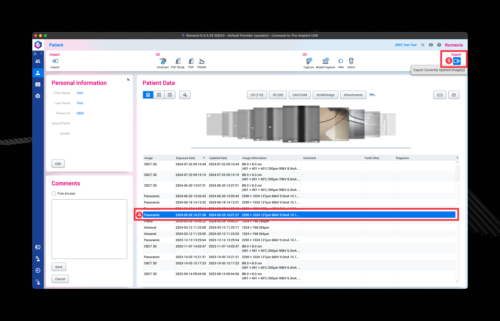

# Panoraminės ar 3D nuotraukos eksportavimas

## Atsidaryti Romexis programą

1. Įvesti paciento vardą, pavardę  

2. Pasirinkti pacientą iš sąrašo  

3. Paspausti "Select Patient"

4. Pasirinkti nuotrauką, kurią norėsite atsisiųsti

5. Jei pasirinkus paspausti "Export"  

## Apple

6. Įvesti į pavadinimo laukelį paciento vardą ir pavardę

7. Nurodyti, kur norite, kad nuotrauka būtų išsaugota

8. Paspausti "Save"  

## Windows

6. Įvesti į pavadinimo laukelį paciento vardą ir pavardę

7. Nurodyti, kur norite, kad nuotrauka būtų išsaugota

8. Paspausti "Save"  

9. 7-ame žingsnyje nurodytoje vietoje ieškome išsaugotos nuotraukos  

