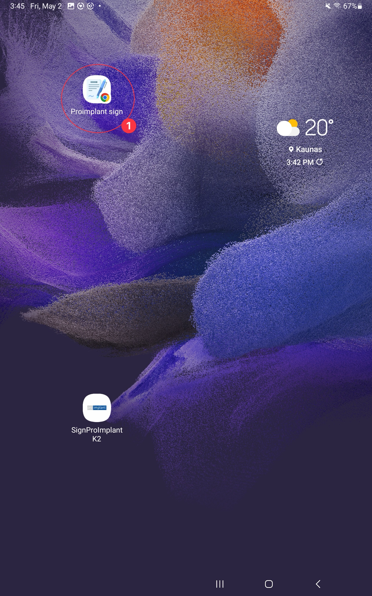
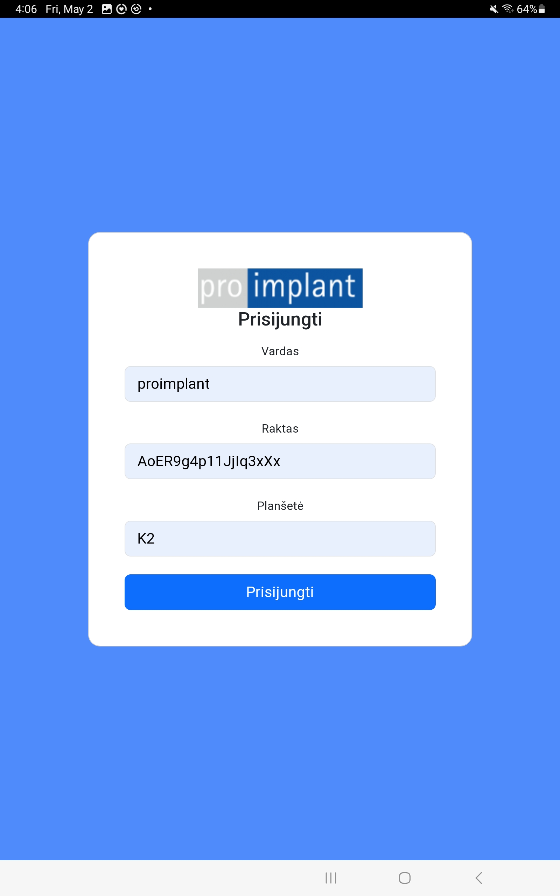

<!DOCTYPE html>
<html lang="lt">
<head>
  <meta charset="UTF-8">
  <title>Prisijungimas</title>
</head>
<body>
  <h1>Prisijungimas prie naujos pasirašymo sistemos</h1>

  <h2>Atsidaryti Pro-implant Sign programą</h2>

  <ol>
    <li>
      Paspausti ant Proimplant sign programėlės arba naršyklėje įvesti adresą:
      <a href="https://sign.proimplant.lt/api4_tablet/index.php" target="_blank">https://sign.proimplant.lt/api4_tablet/index.php</a> 
      
    </li>
    <li>
      Įvesti prisijungimo duomenis (jie turėtų išlikti planšetės atmintyje)
      <ol type="a">
        <li>Vardas - proimplant</li>
        <li>Raktas - AoER9g4p11JjIq3xXx</li>
        <li>Planšetė - Nurodomas kabineto numeris (ty. K1, K2, K3, K4, K5, K6)</li>
      </ol>
      
    </li>
    <li>
      Planšetė prijungta! Norint atsijungti nuspauskite tašką sakinio gale 
      
    </li>
  </ol>
</body>
</html>
