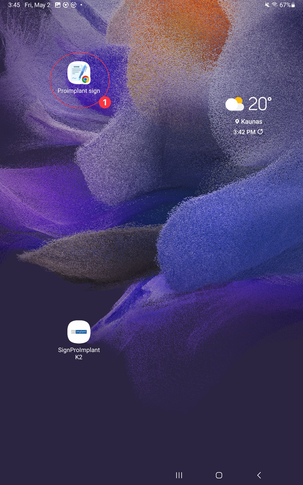
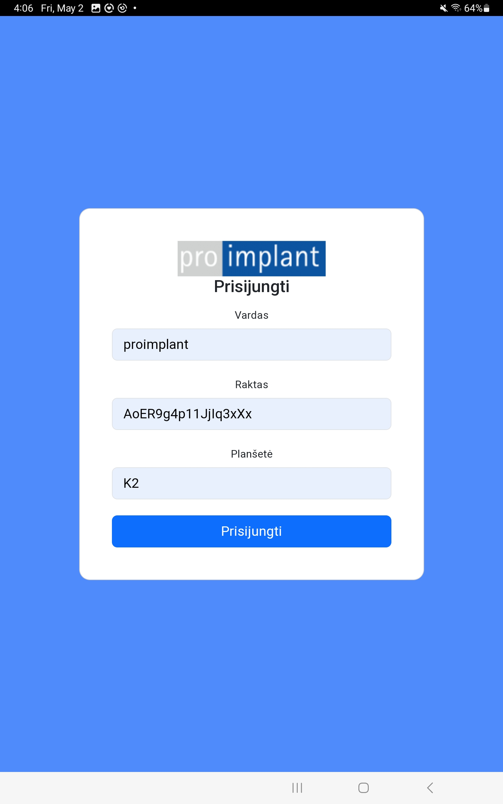

# Prisijungimas prie naujos pasirašymo sistemos

## Atsidaryti Pro-implant Sign programą

1. Paspausti ant Proimplant sign programėlės arba naršyklėje įvesti adresą: https://sign.odontologas.lt/api4_tablet/login.php 

2. Įvesti prisijungimo duomenis (jie turėtų išlikti planšetės atmintyje)
	1. Vardas - proimplant
	2. Raktas - AoER9g4p11JjIq3xXx
	3. Planšetė - Nurodomas kabineto numeris (ty. K1, K2, K3, K4, K5, K6)

3. Planšetė prijungta! Norint atsijungti nuspauskite tašką sakinio gale

